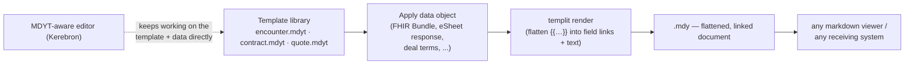
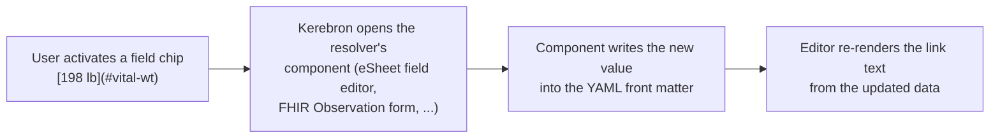

# MDY — Markdown + YAML Linked Documents

**Status:** Draft proposal · **File extensions:** `.mdy` (document), `.mdyt` (template); both valid as plain `.md`
**Audience:** developers and medical-informatics professionals
**Examples:** [samples/README.md](../samples/README.md)

## 1. What is MDY?

MDY is a convention for a single text file in which **YAML front matter is the
canonical, structured data** and the **markdown body is the human-readable
narrative** — with the two layers explicitly *linked* rather than merely adjacent.

```
---            ← structured data (YAML: FHIR, eSheet, any YAML standard object)
...            ← every addressable object carries a stable id
---
narrative      ← plain markdown; values appear as ordinary links
               ← [display text](#id) binds a text span to a front-matter object
```

It is "MDX without the risks": MDX embeds executable JavaScript in markdown, so
opening a document can run code. MDY embeds only **data** and **standard
markdown links**. There is nothing to execute; a hostile `.mdy` file is exactly
as dangerous as a hostile `.yaml` file plus a hostile `.md` file — i.e., inert.

### Design goals

1. **Degrade gracefully.** Any markdown viewer (GitHub, VS Code preview,
   email-to-HTML) renders the narrative perfectly; the links are harmless anchors.
2. **Machine-parseable with stock tooling.** The data layer is plain YAML; the
   link layer is a standard CommonMark link node. No custom markdown extension
   is required to *read* an MDY file.
3. **Single source of truth.** The typed value lives once, in front matter.
   The body shows a human rendering of it (`89.8 kg` in data, `198 lb` on screen).
4. **Send-anywhere interoperability.** A FHIR-aware system ingests the front
   matter Bundle; everyone else reads the report as-is. One file, both audiences.
5. **No code, ever.** Unlike MDX, the format defines no mechanism for embedding
   or evaluating executable content.

## 2. File types

MDY defines two tiers — a reusable **template** and a **flattened document**:

| Extension | Tier | Contains templating? | Renders in a plain markdown viewer? |
|---|---|---|---|
| `.mdyt` | Template | Yes — templit expressions (`{{…}}`, loops, conditionals) in the body | No — placeholders show literally; requires an MDYT-aware editor or a render step |
| `.mdy` | Document | No — fully flattened; body contains only markdown + field links | Yes |
| `.md` | Document | No — an `.mdy` is a strict subset of markdown + front matter, so it may also be shipped as `.md` | Yes |

| Property | Value |
|---|---|
| Encoding | UTF-8 |
| Suggested media types | `text/markdown; variant=mdy` · `text/markdown; variant=mdyt` |
| Front matter | Single YAML block delimited by `---` at byte 0, per common front-matter convention (gray-matter compatible) |

Choosing `.mdy` signals to editors (Kerebron, VS Code) that the front matter
and body are *linked* and should be validated together, while any `.md` tool
still opens the file untouched. Choosing `.mdyt` signals that the body must be
rendered (§6) before the file is portable.

**Template syntax belongs only in `.mdyt`.** Interpolations (`{{…}}`) and
especially block helpers (`{{#each}}`, `{{#if}}`, ``) MUST NOT appear
in a `.mdy` or `.md` body. Most markdown processors do not handle them well:
placeholders render literally, and block-helper lines break lists, tables, and
paragraph flow. The whole point of the two-tier split is that everything a
plain viewer would mangle is consumed by the flatten step (§6.1) and never
reaches the document tier.

### 2.1 The template → document pipeline



- An **MDYT-aware editor** can keep the file as `.mdyt` indefinitely, editing
  template and data side by side.
- When the document must travel — save-as, export, send to another system —
  the template is rendered once and the result is written as `.mdy` (or `.md`),
  which works everywhere with no MDY tooling at all.
- Rendering is **one-way and explicit**: a `.mdy` records which template
  produced it (`mdy.template` provenance key, §2.3) but is never re-flattened
  automatically.

### 2.2 Templates with or without data ("on the shelf")

A `.mdyt` may be published in two forms:

| Form | Front matter contains | Use |
|---|---|---|
| **Data-free** | Only a `mdy.schema` declaration of the *shape* it expects (e.g. "a FHIR Bundle", "eSheet form X", "quote terms") | A shelf library of reusable templates: patient encounter, contract, quote, invoice, referral letter… Apply any conforming object to produce a document |
| **Data-bearing** | Sample or default data (an abstraction/fixture) | Self-demonstrating template: renders as-is for preview; real data replaces the defaults at apply time (templit merge semantics — explicit variables override front matter) |

This enables an organizational **template library**: pick `encounter.mdyt` off
the shelf, apply this visit's FHIR Bundle, and get a portable `.mdy` report;
pick `contract.mdyt`, apply the deal terms, and get the agreement.

### 2.3 Template header

A `.mdyt` declares itself under a reserved `mdy:` key in front matter; a
rendered `.mdy` carries provenance under the same key:

```yaml
# in a .mdyt
mdy:
  kind: template
  engine: handlebars          # templit engine: handlebars | mustache | liquid
  schema: fhir/Bundle         # shape of the data object it expects
  name: Occupational-health encounter report
  version: 1.2.0

# in a rendered .mdy
mdy:
  kind: document
  template: { name: Occupational-health encounter report, version: 1.2.0 }
  renderedAt: 2026-07-26T14:00:00Z
```

## 3. The two layers

### 3.1 Front matter — canonical data

The front matter is any YAML document in which addressable objects carry a
stable **`id`** (unique within the file, `[a-z0-9_-]+`). The *schema* of the
YAML is declared by the data itself and interpreted by a **resolver** (§5):

| Resolver | Front-matter shape | Canonical example |
|---|---|---|
| `fhir` | A FHIR R4 resource or `Bundle`; each `entry` has `id` + `resource` | [samples/back-pain-encounter.md](../samples/back-pain-encounter.md) |
| `esheet` | `fields:` map keyed by field id, values mirror eSheet `FieldDefinition`/`FieldResponse` | §7.1 |
| `templit` | Flat/nested variables consumed by Handlebars/Mustache/Liquid interpolation | vendor/templit |
| *(generic)* | Any YAML standard object — e.g., an ANSI X12 837 claim expressed in YAML — as long as linked nodes have ids | §5 |

> **Authoring pitfall — quote YAML-special values.** Clinical and standards
> vocabularies are full of strings that are *not* safe as bare YAML scalars,
> especially inside flow mappings (`{ ... }`): UCUM codes like `mm[Hg]` and
> `[degF]` (`[` starts a flow sequence), `%`, values with `:`, `#`, or leading
> `*`/`&`. One unquoted `code: mm[Hg]` makes the entire front matter — and thus
> the whole document — unparseable. Always quote such values
> (`code: "mm[Hg]"`); emitters SHOULD serialize with a YAML library rather than
> string templates, and validators SHOULD surface front-matter parse errors as
> a document-level diagnostic.

### 3.2 Body — linked narrative

A **field link** is an ordinary markdown link whose destination names a
front-matter id:

```markdown
- Weight: [198 lb (89.8 kg)](#vital-wt)
```

Grammar of the destination (two accepted dialects):

```
field-link-dest = "#" id            ; anchor form — default, cleanest render
                | "mdy:" id         ; scheme form — unambiguous, self-describing
id              = [a-z0-9_-]+
```

- The **link text** is the human-readable display of the value.
- The **destination** carries *only the id*. All typing, units, codes, and
  metadata stay in front matter (DRY — one source of truth).
- Because it is a real CommonMark link, every parser yields
  `{type: "link", url, children: [text]}` — the entire link layer is
  extractable with an off-the-shelf markdown AST walk.

**Why not the alternatives**

| Alternative | Rejected because |
|---|---|
| HTML comments `<!-- begin vitals -->` | Invisible but out-of-band; span↔key mapping is positional and brittle; editors reflow or strip comments |
| Pandoc spans `[198 lb]{#vital-wt}` | Render literally in GitHub/VS Code — fails "degrade gracefully" |
| MDX components `<Vital id="wt"/>` | Requires a JS runtime; code-execution risk; blank output in plain viewers |

## 4. Editing semantics (Kerebron)

The defining behavior of MDY editors: **linked text is edited through the data,
not the text.**



1. In Kerebron, each field link is a **`fieldLink` mark** (non-inclusive,
   carrying only the id) rendered as an interactive chip.
2. **Activating** the chip opens the component supplied by the resolver — an
   eSheet field editor, a FHIR Observation form, a plain YAML editor — which
   manipulates the *front matter*. The displayed text is then regenerated from
   the data. The user never edits the projection directly.
3. **Typing inside** the chip instead *unlinks* it: the mark breaks, the span
   becomes plain text, and the front-matter object is now an **orphan**.
4. The editor **warns** on orphans and offers a quick-fix: *remove the
   front-matter entry* or *keep it* (author's choice).

### Diagnostics (LSP)

| Condition | Severity | Quick-fix |
|---|---|---|
| Body link → id missing from front matter (*dangling link*) | Error | Create stub object / unlink to plain text |
| Front-matter id with no body link (*orphan*) | Warning | Remove entry / insert link at cursor / keep |
| Display text inconsistent with data (resolver-checked) | Info | Regenerate display text from data |

## 5. Resolvers (MDX-like plugins, without the code risk)

A **resolver** is a plugin registered *in the editor/toolchain* — never in the
document — that understands one front-matter schema:

```typescript
interface MdyResolver {
  /** Schema this resolver claims, e.g. detects `resourceType: Bundle` */
  detect(frontMatter: unknown): boolean;
  /** Enumerate addressable objects: id → typed object */
  index(frontMatter: unknown): Map<string, unknown>;
  /** Render the human display text for an object (used to (re)generate link text) */
  display(id: string, object: unknown): string;
  /** Editor component that edits the object (Kerebron chip activation) */
  component?(id: string, object: unknown): EditorComponent;
  /** Optional schema validation → LSP diagnostics */
  validate?(frontMatter: unknown): Diagnostic[];
}
```

Key contrast with MDX plugins: MDY documents **name data, not behavior**. A
document cannot request code; the host decides which resolvers are installed.
An unrecognized schema simply falls back to the generic YAML resolver
(id-indexing + plain YAML editing), and the document still renders everywhere.

Proposed initial resolvers:

- **`templit`** — build on the existing templit library (gray-matter front
  matter + variable interpolation) as the base parse/merge layer.
- **`esheet`** — front-matter `fields:` map mirroring eSheet
  `FieldDefinition`/`FieldResponse`; chip activation opens the matching eSheet
  field component.
- **`fhir`** — FHIR R4 resources/Bundles; ids are `entry.id`; validation
  against resource schemas; components per resource type.
- **`generic`** — any YAML object graph (e.g., ANSI X12 837 in YAML); links
  resolve by id; editing is structural YAML editing.

## 6. Templates: MDYT and templit

templit already provides the template half: gray-matter extraction, YAML
variable parsing, merge semantics (`parseTemplate`, `parseVariables`,
`mergeVariables`), and rendering via Handlebars/Mustache/Liquid. MDY extends it
in two ways:

1. **Typed front matter** — the data applied to a template may be a standards
   object (FHIR, eSheet, 837-in-YAML), not just a flat variable bag.
2. **The link layer** — templit interpolation (`{{var}}`) is one-way
   (data → rendered text). MDY field links are *addressable spans* that
   survive in the output, support round-tripping, and drive data-first editing.

### 6.1 Rendering an `.mdyt` to an `.mdy`

Flattening is templit rendering with one addition: interpolations are emitted
as **field links**, not bare text, so the output stays linked to its data.

**Implicit field links** make this automatic. When a template interpolates a
whole field-shaped variable — an object with `display` and/or `value`
(+ optional `unit`) — templit renders it in field-link form using the
variable's own key as the id:

```markdown
<!-- encounter.mdyt (template body) -->
- Weight: {{weight}}

<!-- encounter.mdy (after applying the data object) -->
- Weight: [198 lb (89.8 kg)](#weight)
```

Display text is `display` when present, else `value` + `unit`. Explicit paths
(`{{weight.value}}`, `{{weight.display}}`) interpolate plainly as before — use
them (with triple-stache for strings needing raw output) to compose custom
link text, and pass `fieldLinks: false` to disable the behavior entirely.

The render step:

1. Merge the applied data object over any front-matter defaults
   (templit merge semantics — explicit data wins).
2. Render the body with the declared engine, producing plain markdown whose
   interpolated values sit inside field links.
3. Write the merged data as the `.mdy` front matter and stamp `mdy.template`
   provenance (§2.3).

Template control flow (`{{#each}}`, `{{#if}}`, ``) is consumed by the
render and never appears in the `.mdy` — the flattened file is loop-free,
condition-free, and viewer-safe. These constructs are valid *only* in `.mdyt`
(§2): a `.mdy`/`.md` containing them is non-conformant, and processors SHOULD
flag leftover template syntax in a document as a diagnostic.

**Note on "no code":** templit expressions are declarative data interpolation
evaluated by the *host's* templit install at render time — the template cannot
smuggle in arbitrary execution any more than a Mustache email template can.
The rendered `.mdy` contains no expressions at all.

## 7. Examples

Runnable versions of these examples — including full `.mdyt`/`.mdy`/`.md`
trios you can diff to see the flatten step — are indexed in
[samples/README.md](../samples/README.md).

### 7.1 Minimal (eSheet resolver)

```markdown
---
fields:
  body_height: { fieldType: text, question: Height, value: 180,  unit: cm }
  body_weight: { fieldType: text, question: Weight, value: 89.8, unit: kg }
---
## Vitals
- Height: [5'11"](#body_height)
- Weight: [198 lb](#body_weight)
```

Front matter stores the normalized value (`180 cm`); the body shows the
clinician-friendly rendering (`5'11"`). Editing "Height" in Kerebron opens the
eSheet text-field component bound to `fields.body_height`.

### 7.2 Clinical document (FHIR resolver)

See [samples/back-pain-encounter.md](../samples/back-pain-encounter.md): a full
encounter report whose front matter is a FHIR R4 `Bundle` (Patient, allergies,
problem list, coded vitals, a Schedule II prescription, a temporary dose
adjustment, a work restriction, and a follow-up), and whose body is the
narrative every markdown viewer can render.

### 7.3 Shelf template (`.mdyt`, data-free)

```markdown
---
mdy:
  kind: template
  engine: handlebars
  schema: fhir/Bundle
  name: Encounter report
  version: 1.0.0
---
# Encounter Report

**Patient:** [{{patient.name}}](#patient) · **DOB:** [{{patient.birthDate}}](#patient)

## Vitals
{{#each vitals}}
- {{label}}: [{{display}}](#{{id}})
{{/each}}
```

Applying a visit's FHIR Bundle renders the `.mdy` in §7.2. The same pattern
yields `contract.mdyt` (apply deal terms), `quote.mdyt` (apply pricing), and
other on-the-shelf document types.

## 8. Security model

- **No executable content.** MDY defines no expression language, no component
  tags, no script blocks. Parsing an MDY file is parsing YAML + markdown.
- **Capability lives in the host.** Resolvers/components are installed in the
  editor, chosen by the deployment — a document can never introduce one.
- **Safe YAML only.** Implementations MUST use safe YAML loading (no custom
  tags instantiating arbitrary types).
- Link destinations are inert identifiers; renderers that don't understand
  `mdy:` simply show the text.

## 9. Conformance summary

An MDY processor:

1. MUST parse the leading `---`-delimited YAML block with a safe loader.
2. MUST treat body links matching `#<id>` or `mdy:<id>` — where `<id>` exists
   in the front-matter index — as field links.
3. MUST round-trip files losslessly (byte-identical body + front matter when
   nothing changed).
4. SHOULD report dangling links and orphaned data as diagnostics, and SHOULD
   flag any template syntax (`{{…}}`, `{{#each}}`, ``) found in a
   `.mdy`/`.md` body — template constructs are valid only in `.mdyt` (§2).
5. MUST NOT execute any content found in a `.mdy` document.
6. Editors SHOULD update linked spans by editing the data and regenerating the
   display text, and SHOULD unlink a span when the user edits its text directly.

An MDYT processor additionally:

7. MUST render templates only with a declarative templit engine
   (Handlebars/Mustache/Liquid) — no arbitrary code evaluation.
8. MUST produce a `.mdy`/`.md` free of template syntax, with merged data as
   front matter and `mdy.template` provenance recorded.
9. SHOULD validate the applied data object against the template's declared
   `mdy.schema` before rendering.
10. When saving for a non-MDYT-aware destination, SHOULD offer flattening to
    `.mdy` (or `.md`) so the document remains viewable everywhere.
